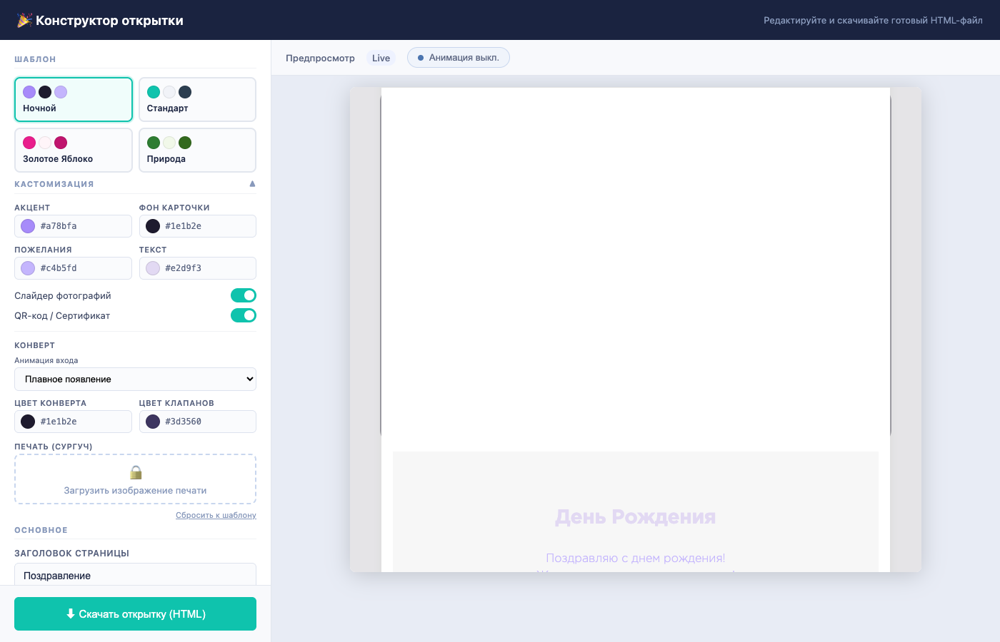
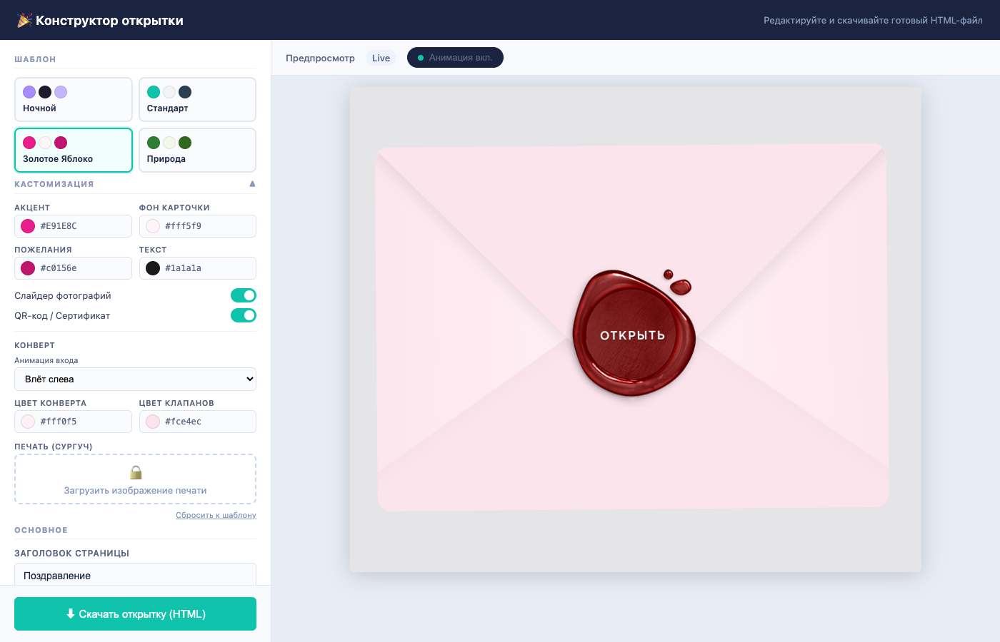
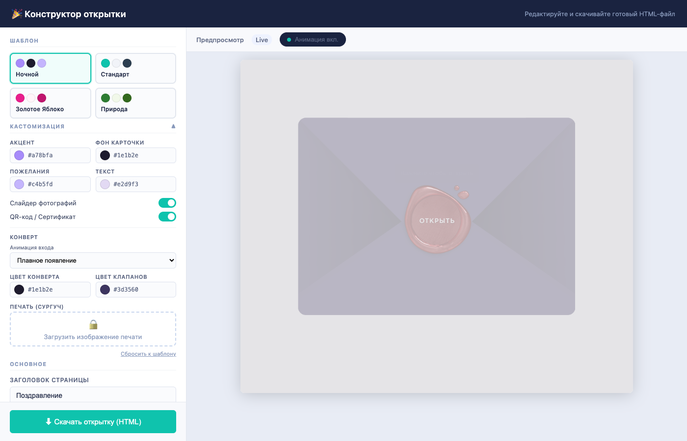
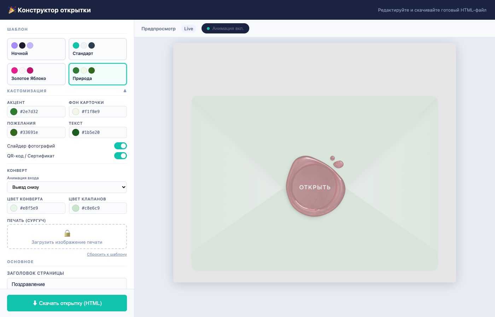
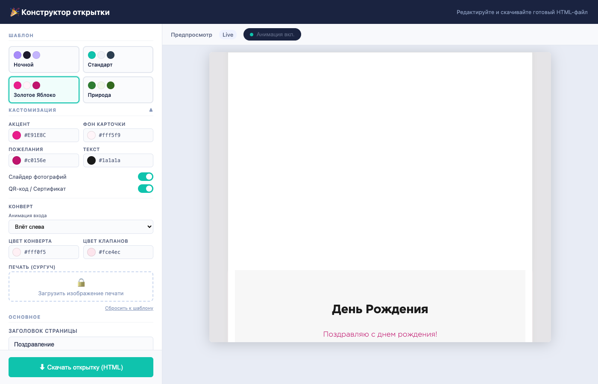

# Конструктор поздравительных открыток

Визуальный редактор для создания персональных поздравительных открыток с анимированным конвертом, слайдером фотографий и QR-кодом. На выходе -- один HTML-файл, полностью автономный и готовый к размещению на любом хостинге.



---

## Быстрый старт

```bash
node build.js        # собрать admin.html
open admin.html      # открыть в браузере
```

Через локальный сервер:

```bash
npx serve -p 3456 .
# http://localhost:3456/admin.html
```

---

## Возможности

### Шаблоны оформления

Четыре готовых шаблона с уникальными цветовыми схемами и настройками конверта. Переключение -- в один клик.

| Шаблон | Стиль | Анимация конверта |
|--------|-------|-------------------|
| Стандарт | Светлый, бирюзовый акцент | Падение сверху |
| Ночной | Тёмный, фиолетовые тона | Плавное появление |
| Золотое Яблоко | Розовый, фуксия-акцент | Влёт слева |
| Природа | Зелёный, натуральные тона | Выезд снизу |



### Кастомизация

Каждый шаблон можно настроить под себя:

- **Цвета**: акцент, фон карточки, текст, пожелания
- **Конверт**: цвет тела, цвет клапанов, анимация входа (5 вариантов), загрузка своей печати (сургуча)
- **Контент**: слайдер фотографий (до 10), QR-код / сертификат
- **Типографика**: размер и выравнивание текста



### Анимация конверта

Пять анимаций появления конверта:

- **Падение сверху** -- классический drop с отскоком
- **Влёт слева** -- конверт прилетает с лёгким поворотом
- **Влёт справа** -- зеркальный вариант
- **Плавное появление** -- fade-in с масштабированием
- **Выезд снизу** -- подъём с пружинным эффектом

После появления конверт покачивается, приглашая нажать на печать. Клик по печати запускает анимацию раскрытия -- клапан поднимается, карточка выезжает вверх.



### Предпросмотр

Два режима превью:

- **Анимация выкл.** -- содержимое открытки видно сразу, удобно при редактировании
- **Анимация вкл.** -- конверт с полной анимацией, как увидит получатель



---

## Как пользоваться

1. Открыть `admin.html` в браузере
2. Выбрать шаблон в секции **ШАБЛОН**
3. Настроить цвета и конверт в **КАСТОМИЗАЦИЯ**
4. Заполнить поля: событие, получатель, пожелания, фото, QR-код
5. Переключить **Анимация вкл.** для проверки конверта
6. Нажать **Скачать открытку (HTML)** -- скачается автономный `card.html`
7. Разместить `card.html` на сервере

---

## Структура проекта

```
post-card/
├── admin.html              # Редактор (генерируется build.js)
├── build.js                # Скрипт сборки
├── setings.js              # Пример данных открытки
├── templates/              # JSON-шаблоны оформления
│   ├── default.json
│   ├── dark.json
│   ├── golden-apple.json
│   └── nature.json
├── postcard/               # Исходники открытки
│   ├── index.html          # HTML-шаблон
│   ├── css/
│   │   ├── partner_card.css    # Основные стили
│   │   ├── style.css           # Анимации, слайдер, конверт
│   │   └── fonts/              # GothamPro (woff)
│   └── script/
│       ├── script.js                   # Слайдер (класс Sim)
│       ├── partner_card.js             # Анимация конверта
│       ├── constructor_integration.js  # Привязка данных
│       └── json_loader.js             # Инициализация из jsonData
├── page/                   # Статическая страница-пример
└── img/                    # Изображения и скриншоты
```

### Система шаблонов

Шаблоны -- JSON-файлы в `templates/`. Каждый определяет:

```json
{
  "id": "golden-apple",
  "name": "Золотое Яблоко",
  "colors": {
    "primary": "#E91E8C",
    "cardBg": "#fff5f9",
    "text": "#1a1a1a",
    "wishes": "#c0156e"
  },
  "envelope": {
    "animation": "slide-left",
    "color": "#fff0f5",
    "flapColor": "#fce4ec",
    "theme": "classic"
  },
  "typography": {
    "wishesSize": "17px",
    "align": "center"
  },
  "layout": {
    "showSlider": true,
    "showQr": true
  }
}
```

Цвета из шаблона инжектируются как CSS-переменные через `:root{}`, конверт настраивается через data-атрибуты и inline-стили.

---

## Экспорт

Скачанный `card.html` содержит всё необходимое:

- CSS + шрифты GothamPro (base64)
- jQuery, Lodash, Clipboard.js, Cleave.js
- Анимации конверта и слайдер
- Фотографии и QR-код (base64)
- Данные открытки как встроенный JS-объект

Никаких внешних запросов -- файл работает даже офлайн.

---

## Пересборка

При изменении исходников в `postcard/` или шаблонов в `templates/`:

```bash
node build.js
```

---

## Стек

- Vanilla HTML/CSS/JS -- без фреймворков и сборщиков
- jQuery 2.1.3 для анимаций конверта
- Node.js для сборки `admin.html` (`build.js`)
